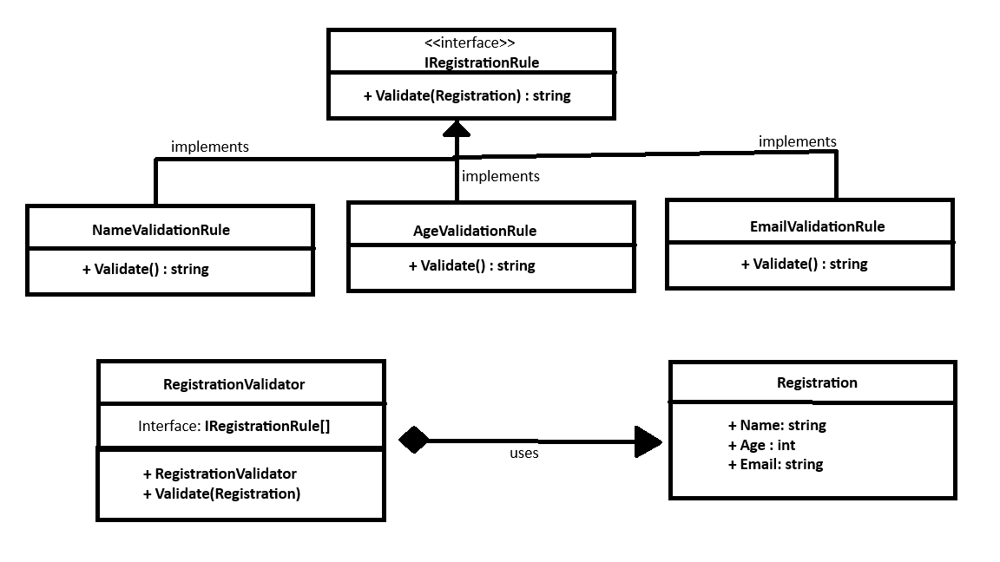

# Registration Validation Using the Open/Closed Principle

## Student Details

- **Name:** Sangam
- **Roll Number:** 112201006
- **Email:** 112201006@smail.iitpkd.ac.in

## Overview

This project validates event registrations using independently extensible rules. It demonstrates the SOLID Open/Closed Principle because new validation rules can be added without changing `RegistrationValidator`.

A registration contains:

- Name
- Age
- Email address


## UML Diagram


## Build and Test


```
dotnet restore "SoftwareDesignPatternsOpenClosedPattern.slnx"
dotnet build "SoftwareDesignPatternsOpenClosedPattern.slnx"
dotnet test "SoftwareDesignPatternsOpenClosedPattern.slnx"
```
